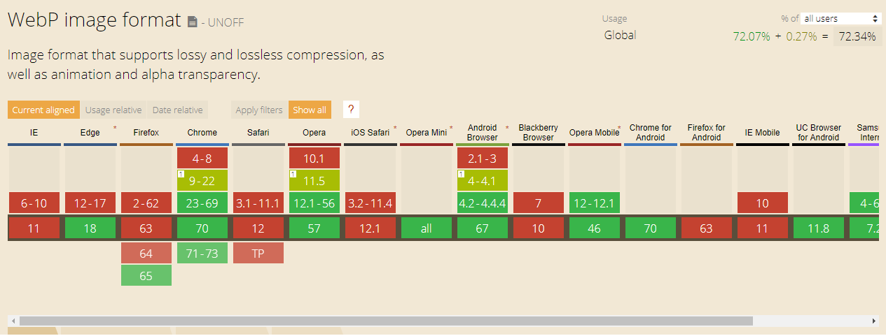

# webp
Investigating Google's WebP image format.

## What?
Google's [WebP image format](https://developers.google.com/speed/webp/) provides superior compression and quality characteristics compared to its older JPEG and PNG counterparts.

## How?
You can convert images to use the WebP format via the `cwebp` CLI tool provided as part of the `libwebp` codec. Simply download the appropriate `libwebp` version for your machine from [the repository](https://storage.googleapis.com/downloads.webmproject.org/releases/webp/index.html), then add the `bin` directory to your `PATH` so the `cwebp` tool is accessible via your terminal.

See Google's [Getting Started](https://developers.google.com/speed/webp/docs/using) docs for more information.

**Generate Lossy Image (default)**
* `$ cwebp {original-image} -o {new-image}.webp`

**Generate Lossless Image**
* `$ cwebp -lossless {original-image} -o {new-image}.webp`

## Support
[WebP caniuse.com stats](https://caniuse.com/#feat=webp)

Although we currently do not have cross-browser support for WebP, Google has provided a number of [fallback options](https://developers.google.com/speed/webp/faq#how_can_i_detect_browser_support_for_webp) for us to use.

## Testing

| Type | Result | Size |
| ---- | ------ | ---- |
| Original |  | 240kb |
| Compressed - lossy |  | 40kb |
| Compressed - lossless |  | 173kb |
